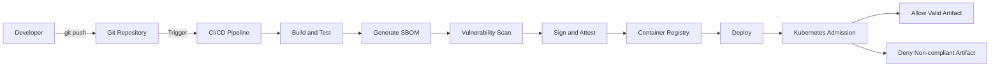

# Design and Implementation of Automated Supply Chain Security for Go Microservices on Kubernetes

This repository provides a practical DevSecOps baseline for implementing and validating software supply chain security controls for a Go microservice deployed on Kubernetes.

## What This Repository Delivers
- A CI pipeline for build, SBOM generation, vulnerability scanning, signing, and attestation.
- Kubernetes admission policies for signature/provenance and metadata enforcement.
- Reproducible local validation workflow using Kind + Kyverno.
- Thesis-aligned documentation, traceability, and evidence artifacts.

## Architecture Overview


## Quickstart
### 1) Local service run
```bash
go test ./...
go run main.go server --config cmd/server/config/local.yaml
```

### 2) Trigger secure supply-chain workflow
- Push to branch `Thesis-SCS` or manually run `.github/workflows/secure-supply-chain.yml`.

### 3) Bootstrap local admission demo
```bash
COSIGN_PUB_PATH=./cosign.pub ./scripts/devsecops_kind_bootstrap.sh
kubectl get clusterpolicies
```

## Thesis Documentation
- [Thesis specification (English)](docs/thesis_spec_en.md)
- [CI and admission flow](docs/devsecops_ci_admission.md)
- [Implementation roadmap and milestones](docs/implementation_roadmap.md)
- [Demo evidence logs](docs/demo_evidence.md)

## Notes
- Current enforcement baseline is Kyverno-based.
- Sigstore Policy Controller remains an optional future extension.
