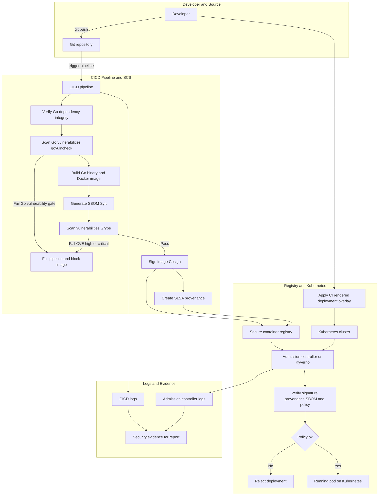

# Design and Implementation of Automated Supply Chain Security for Go Microservices on Kubernetes

This repository provides a practical DevSecOps baseline for implementing and validating software supply chain security controls for a Go microservice deployed on Kubernetes.

## What This Repository Delivers
- A CI pipeline for build, SBOM generation, vulnerability scanning, signing, and attestation.
- Kubernetes admission policies for signature/provenance and metadata enforcement.
- Reproducible local validation workflow using Kind + Kyverno.
- Thesis-aligned documentation, traceability, and evidence artifacts.

## Service Landscape (23 Services)
The monorepo includes 23 services to validate supply-chain pipeline repeatability at scale (full list in `services.yaml`):

- Core baseline:
  - `user-service`: user/auth lifecycle with token flows and notification integration
  - `portfolio-service`: portfolio summary and concentration logic
  - `order-service`: order validation rules (cash/holding/notional checks)
  - `risk-service`: risk scoring and trading block decision
- Trading-core expansion:
  - `market-data-service`: quote snapshot normalization (`POST /market-data/snapshot`)
  - `pricing-service`: quote computation (`POST /pricing/quote`)
  - `execution-service`: fill simulation (`POST /execution/simulate`)
  - `settlement-service`: T+N settlement preview (`POST /settlement/preview`)
  - `compliance-service`: policy/rule checks (`POST /compliance/check`)
  - `notification-service`: channel/message rendering (`POST /notification/render`)
- Extended services (same supply-chain baseline + CI matrix):
  - `apikey-service`, `kyc-service`, `watchlist-service`, `analytics-service`, `audit-service`, `fees-service`, `reporting-service`, `gateway-service`, `search-service`, `alert-service`, `data-feed-service`, `backtest-service`, `margin-service`

## Architecture Overview
For the thesis-facing presentation version with visual legend and explanatory notes, open [docs/scs_architecture_diagram.html](docs/scs_architecture_diagram.html).



## Quickstart
### 1) Local service run
```bash
go test ./...
go run main.go server --config cmd/server/config/local.yaml
```

### 2) Trigger secure supply-chain workflow
- Push to branch `main` or manually run `.github/workflows/ci-service.yml`.

### 3) Bootstrap local admission demo
```bash
./scripts/devsecops_kind_bootstrap.sh
kubectl get clusterpolicies
```

Clean rerun / teardown:
```bash
RESET_CLUSTER=true ./scripts/devsecops_kind_bootstrap.sh
./scripts/devsecops_kind_reset.sh
```

Deployment contract note:
- `deploy/kubernetes/base/deployment.yaml` keeps security annotations empty by design.
- With Kyverno policies enabled, apply CI-rendered overlay (`deploy/kubernetes/overlays/ci`) for compliant deploys.

## Minimum Requirements
To run this repository reliably (local + CI), use the following baseline:

1. OS
- Windows 10/11 x64, or Ubuntu 22.04+ for Linux local development.

2. Required tools
- `git` (with Git Credential Manager)
- `go` `1.25.10`
- `docker` with Buildx
- `gh` (GitHub CLI), authenticated via `gh auth login`
- `python` 3.10+
- `kubectl` and `kind` (required for admission lab flows)

3. GitHub access and permissions
- GitHub token scopes: `repo`, `workflow`
- Add `write:packages` if pushing images to GHCR.
- GitHub Actions must be enabled for the repository.

4. Runner baseline
- GitHub-hosted runners: `ubuntu-latest`, `windows-2022`, `macos-latest`
- Optional self-hosted parity runner labels: `self-hosted`, `Windows`, `X64`, `parity`

5. Repository structure baseline
- `services.yaml` must be valid and mapped to all services.
- Each service should include: `go.mod`, `go.sum`, `Dockerfile`, and runnable `go test ./...`.

## Minimum Hardware
- CPU: `4 cores`
- RAM: `16 GB`
- GPU: not required
- Storage: at least `50 GB` free SSD
- Network: stable internet connection for container/image and artifact downloads

Self-hosted Windows runner minimum:
- CPU: `4 vCPU`
- RAM: `16 GB`
- Free disk for Docker/cache: `20-30 GB`

## CI Scalability Strategy
- Push/PR: changed-only discovery from `services.yaml` (only touched services run full verify + supply-chain checks).
- Nightly: full matrix run for all registered services via `schedule` in `ci-service`.
- Onboarding lab: nightly matrix now reads all services from `services.yaml` to continuously prove compatibility and evidence consistency at scale.

## Scale Evidence
To demonstrate high-scalable behavior:
- Compare changed-only run durations against nightly full-matrix runs.
- Verify each service produces `*-sbom`, `*-grype-report`, and `*-security-gate-findings` artifacts.
- Use dashboard snapshot data (`dashboard-data-sync`) to track run volume and service coverage over time.

## How to Run the Local Signed Demo
Use [scripts/local_signed_demo.ps1](scripts/local_signed_demo.ps1) to run the end-to-end local demonstration on the current Kubernetes context.

Prerequisites:
- Docker Desktop Kubernetes is running.
- `kubectl`, `docker`, `cosign`, `syft`, and `helm` are available in `PATH`.

Run:
```powershell
powershell -NoProfile -ExecutionPolicy Bypass -File scripts/local_signed_demo.ps1 -ResetNamespace
```

What the script does:
- Builds the local application image.
- Pushes the image to a temporary registry target.
- Generates or reuses a local Cosign keypair in `demo/`.
- Produces an SBOM and signs the image and provenance.
- Installs or checks Kyverno, applies the repository policies, and deploys the demo workload.
- Verifies rollout in the `stock-trading` namespace.

After the script completes, inspect the deployment with:
```bash
kubectl get deploy,pods,svc -n stock-trading
kubectl logs -n stock-trading deploy/user-service --tail=40
```

## Admission Matrix (1 allow + 3 deny)
Use [scripts/admission_matrix_demo.ps1](scripts/admission_matrix_demo.ps1) to run the thesis-aligned admission scenarios on `docker-desktop`.

Run:
```powershell
powershell -NoProfile -ExecutionPolicy Bypass -File scripts/admission_matrix_demo.ps1 -Context docker-desktop -Namespace stock-trading -ExportDir demo/evidence -ResetNamespace
```

Expected matrix:
- `VALID_ALLOW`: signed + attested + SBOM annotation + `high_critical=0` is admitted.
- `NEG_UNSIGNED_DENY`: unsigned image is denied.
- `NEG_MISSING_SBOM_DENY`: missing SBOM annotation is denied.
- `NEG_CVE_THRESHOLD_DENY`: non-zero `security.grype.io/high_critical` is denied.

Outputs:
- `matrix-summary.md`: case-by-case verdict table.
- `matrix-index.json`: machine-readable evidence manifest.
- `regression-valid-allow.json`: post-deny regression re-check result.
- Per-case files: `kubectl apply/wait`, events, describe outputs, and Kyverno logs.

## Security Admission Dashboard Demo
Use the static dashboard to present matrix evidence without a live cluster connection.

Prerequisites:
- Run `scripts/admission_matrix_demo.ps1` at least once to generate `demo/evidence/<run-id>/...`.
- Keep local SBOM/scan outputs available (for example `demo/sbom.spdx.json`, `.tmp-sbom.json`, `.tmp-grype.json`).

Run from the repository root:
```bash
python -m http.server 8080
```

Open:
- `http://localhost:8080/docs/security-admission-dashboard/`
- Optional pre-load run id: `http://localhost:8080/docs/security-admission-dashboard/?run=20260406-154444`

Dashboard behavior:
- Auto-scan run directories from `../../demo/evidence/` and select run-id via command-palette dropdown (with search).
- Reads `../../demo/evidence/<run-id>/matrix-index.json`, `matrix-summary.md`, and `regression-valid-allow.json`.
- Shows fixed matrix cards for `VALID_ALLOW`, `NEG_UNSIGNED_DENY`, `NEG_MISSING_SBOM_DENY`, `NEG_CVE_THRESHOLD_DENY`.
- Visualizes SBOM package distribution from `../../demo/sbom.spdx.json` (fallback `../../.tmp-sbom.json`).
- Provides quick links to raw scanner/SBOM artifacts.

## Thesis Documentation
- [Thesis specification (English)](docs/thesis_spec_en.md)
- [Interactive architecture diagram (HTML + Mermaid, presentation layout)](docs/scs_architecture_diagram.html)
- [Go dependency integrity baseline](docs/go_dependency_integrity_baseline.md)
- [CI and admission flow](docs/devsecops_ci_admission.md)
- [Implementation roadmap and milestones](docs/implementation_roadmap.md)
- [Demo evidence logs](docs/demo_evidence.md)
- [Go microservice onboarding and reuse guide](docs/go_microservice_onboarding_guide.md)

## Notes
- Current enforcement baseline is Kyverno-based.
- Runtime trust verification baseline uses keyless Cosign identities from GitHub Actions OIDC (`token.actions.githubusercontent.com`).
- Sigstore Policy Controller remains an optional future extension.


