# Design and Implementation of Automated Supply Chain Security for Go Microservices on Kubernetes

This repository contains the implementation baseline for a thesis project on automated software supply-chain security for Go microservices deployed to Kubernetes.

## Thesis Objective
Build and validate an end-to-end security pipeline where each container artifact is:
- built reproducibly,
- analyzed (SBOM + vulnerability scan),
- signed and attested,
- and enforced at Kubernetes admission time.

## Scope
- Target service: existing Go `user-service`.
- Build/deploy target: Docker image and Kubernetes manifests (Kustomize base + overlays).
- Security controls in scope:
  - SBOM generation (`Syft`)
  - Vulnerability scanning (`Grype`)
  - Image signing and provenance attestation (`Cosign`/Sigstore)
  - Admission enforcement (`Kyverno` policies)

## Target Architecture

```mermaid
flowchart LR
  Dev["Developer"] -->|"git push"| Repo["Git Repository"]
  Repo -->|"Trigger"| CI["CI/CD Pipeline"]
  CI --> Build["Build and Test"]
  Build --> SBOM["Generate SBOM (Syft)"]
  SBOM --> Scan["Scan Vulnerabilities (Grype)"]
  Scan -->|"Pass"| Sign["Sign Image (Cosign)"]
  Sign --> Attest["Create Provenance Attestation (SLSA style)"]
  Sign --> Registry["Container Registry"]
  Attest --> Registry
  Registry -->|"Deploy"| K8s["Kubernetes Cluster"]
  K8s --> Admit["Kyverno Admission Policies"]
  Admit -->|"allow"| Run["Workload Running"]
  Admit -->|"deny"| Block["Unsigned / Non-compliant Rejected"]
```


## Repository Layout
```text
.
|- .github/workflows/secure-supply-chain.yml  # CI pipeline for build, scan, sign, attest
|- deploy/kubernetes/                          # Base manifests + overlays
|- deploy/policies/kyverno/                    # Admission policies
|- docs/                                       # Thesis plan, CI/admission flow, evidence
`- scripts/                                    # Kind/Kyverno bootstrap and demo scripts
```

## Current Implementation Highlights
- Hardened multi-stage Docker build with non-root distroless runtime.
- Automated CI workflow (`secure-supply-chain`) on branch `Thesis-SCS`.
- SBOM output (`sbom.spdx.json`) and Grype report (`grype-report.json`) as CI artifacts.
- Keyless image signing and SLSA-style attestation with Cosign.
- Kubernetes policy set for signature/provenance/CVE/SBOM annotation checks.

## Quickstart
### 1) Local service run
Prerequisites:
- Go `1.24.11` (or compatible with `go.mod`)
- Local dependencies matching `cmd/server/config/local.yaml` (MySQL, Kafka, SMTP if needed)

Run:
```bash
go test ./...
go run main.go server --config cmd/server/config/local.yaml
```

### 2) Trigger secure supply-chain workflow
- Push to branch `Thesis-SCS` or run `workflow_dispatch` on:
  - `.github/workflows/secure-supply-chain.yml`

### 3) Bootstrap local admission demo (Kind + Kyverno)
Prerequisites:
- `kind`
- `kubectl`
- `cosign.pub` available at repo root (or set custom path)

Run:
```bash
COSIGN_PUB_PATH=./cosign.pub ./scripts/devsecops_kind_bootstrap.sh
kubectl get clusterpolicies
```

## Evidence and Technical Documents
- [Supply-chain implementation plan](docs/devsecops_supply_chain_plan.md)
- [CI and admission flow details](docs/devsecops_ci_admission.md)
- [Demo evidence logs](docs/demo_evidence.md)
- [Roadmap milestones and issues](docs/implementation_roadmap.md)

## Evaluation Criteria (Thesis)
- CI blocks artifacts with disallowed vulnerability severity.
- Signed artifacts can be verified and traced to build provenance.
- Kubernetes admission denies unsigned/missing-metadata workloads.
- Process is reusable for additional Go microservices with minimal changes.
