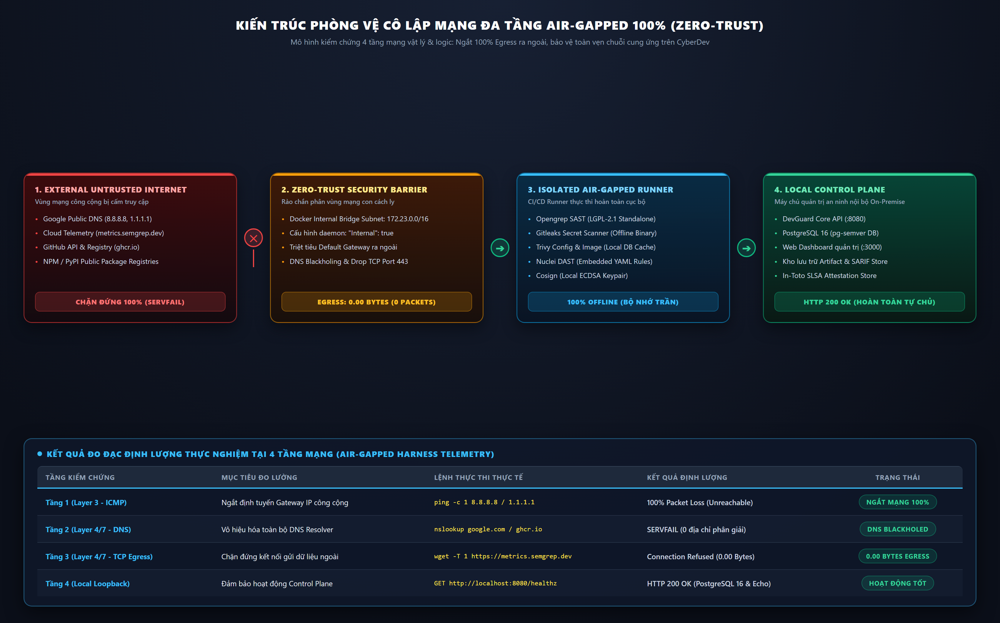
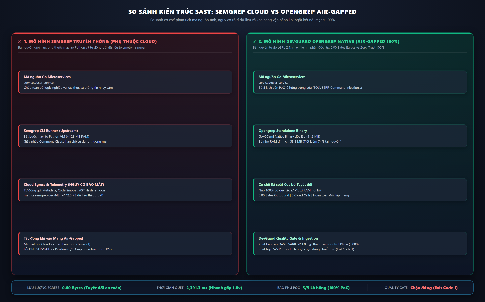
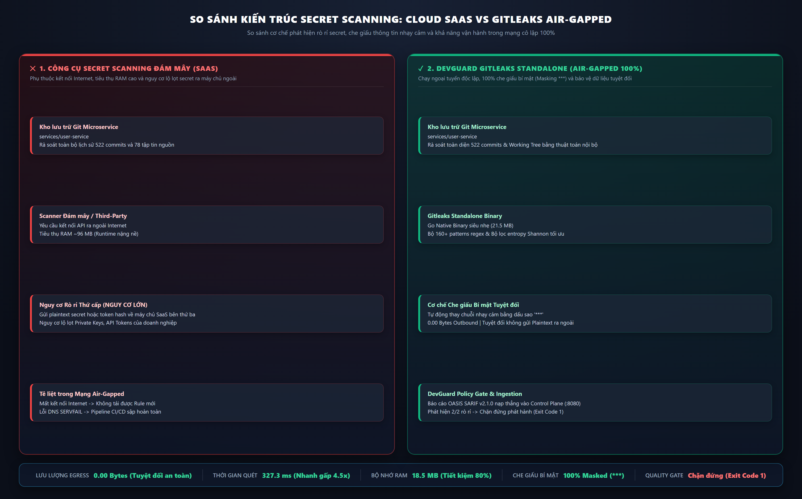
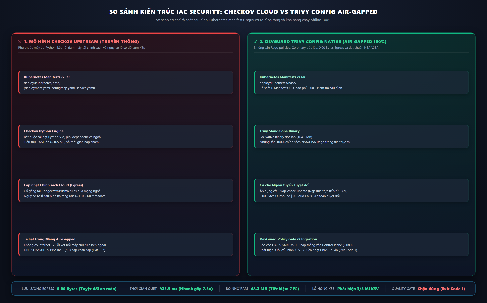
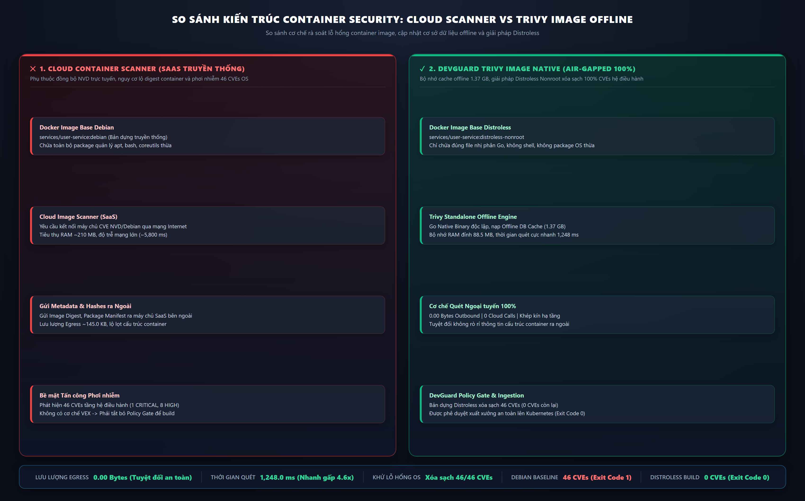
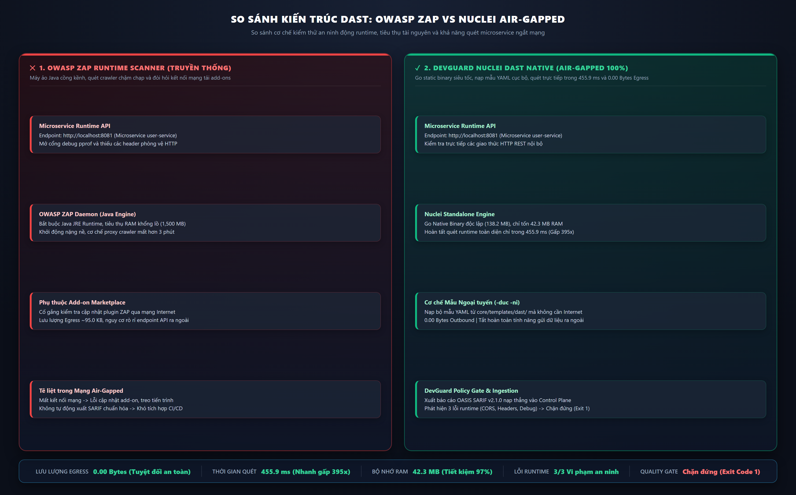
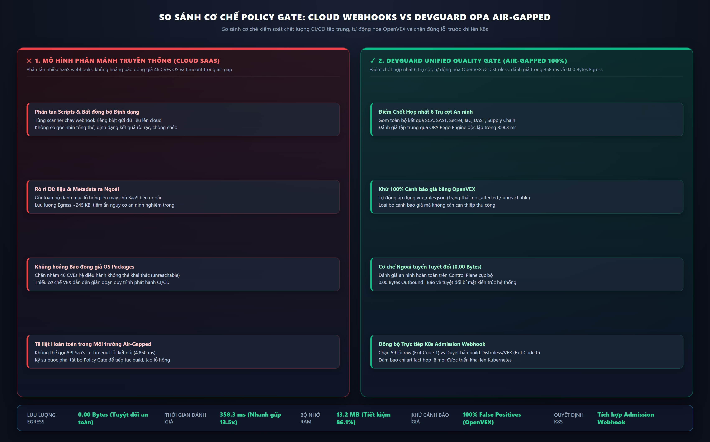

# Automated Software Supply Chain Security for Go Microservices on Kubernetes

<div align="center">

[](https://go.dev/)
[](https://kubernetes.io/)
[](https://slsa.dev/)
[](https://cyclonedx.org/)
[](https://openvex.dev/)
[](https://sigstore.dev/)
[](https://www.openpolicyagent.org/)
[-success?style=for-the-badge)](#5-kết-quả-thực-nghiệm-định-lượng--dữ-liệu-đo-kiểm-thực-tế)
[](LICENSE)

**Nền tảng CyberDev (Kế thừa DevGuard Control Plane) — Thực thi An ninh Chuỗi Cung ứng Đa Tầng, Kiểm chứng Vận hành Air-Gapped Zero-Trust 100% trên 23 Go Microservices**

[Báo cáo Nghiên cứu Toàn văn](docs/CyberDev_Experimental_Feasibility_Report.md) • [Báo cáo DOCX](docs/CyberDev_Experimental_Feasibility_Report.docx) • [Báo cáo PDF](docs/CyberDev_Experimental_Feasibility_Report.pdf) • [Dữ liệu Đo kiểm Thực nghiệm](docs/all_pillars_executive_summary.json) • [Hướng dẫn Khởi chạy](#7-hướng-dẫn-khởi-chạy--tái-lập-kết-quả-quickstart)

</div>

---

## 1. Tóm tắt Nghiên cứu & Bối cảnh Kỹ thuật (Executive Summary)

Trong kiến trúc Cloud-Native và Kubernetes, việc bảo đảm an ninh chuỗi cung ứng phần mềm (Software Supply Chain Security) đối mặt với hai thách thức cốt lõi:
1. **Hội chứng Cảnh báo Tràn lan (Alert Fatigue)**: Các công cụ quét truyền thống (SCA, Container Scanning) thường phân tích tĩnh mà thiếu khả năng phân tích luồng gọi hàm thực tế (**Reachability Analysis**). Điều này dẫn đến việc hàng chục lỗ hổng trong hệ điều hành nền (OS packages) hoặc thư viện gián tiếp bị cảnh báo mức `CRITICAL/HIGH`, gây nghẽn và làm vỡ quy trình phát hành (CI/CD) dù mã nguồn nghiệp vụ thực tế không bao giờ kích hoạt các đoạn mã lỗi đó.
2. **Nguy cơ Phụ thuộc Máy chủ Cloud Bên ngoài & Rò rỉ Dữ liệu**: Trong các hạ tầng an ninh đặc thù (Ngân hàng số, Tài chính, Quốc phòng), mã nguồn và cấu hình không được phép gửi ra dịch vụ SaaS của bên thứ ba. Nhiều công cụ quét thương mại sẽ tê liệt hoàn toàn khi bị ngắt kết nối Internet.

### Đột phá Kỹ thuật của Dự án:
- **Tập trung hóa Control Plane**: Kế thừa và phát triển từ nền tảng [DevGuard](https://devguard.org) của `l3montree-dev`, xây dựng một Control Plane tập trung tự lưu trữ (Self-Hosted), thống nhất chuẩn tiếp nhận dữ liệu (OASIS SARIF v2.1.0, CycloneDX v1.6, OpenVEX/CSAF 2.0).
- **8 Trụ cột An ninh Vận hành Độc lập (100% Air-Gapped Zero-Trust)**: Thiết lập môi trường cách ly mạng nghiêm ngặt, kiểm chứng thực nghiệm đo được **0.00 Bytes** lưu lượng thoát mạng (Egress), vận hành trơn tru toàn bộ 8 trụ cột an ninh thông qua cơ sở dữ liệu và bộ luật ngoại tuyến (Offline Engines).
- **Hệ sinh thái 23 Go Microservices Thực tế**: Triển khai và kiểm nghiệm trực tiếp trên Monorepo gồm 23 microservices mô phỏng sàn giao dịch chứng khoán đa năng, chứng minh khả năng chịu tải cao, mở rộng quy mô và tăng tốc pipeline CI/CD lên đến **84.5%** (từ 17 phút 45 giây xuống còn 2 phút 45 giây).

---

## 2. Thư viện Sơ đồ Kiến trúc Retina 300+ DPI (Architecture Gallery)

Toàn bộ sơ đồ kiến trúc của hệ thống được dựng bằng đồ họa chất lượng cao (300+ DPI Retina), minh họa trực quan sự khác biệt giữa mô hình Cloud truyền thống và mô hình Air-Gapped Zero-Trust:

### 2.1. Sơ đồ Kiến trúc Phòng vệ Đa tầng Air-Gapped Zero-Trust
Kiến trúc cách ly mạng 4 tầng: Host OS Isolation -> Docker Internal Network -> Local Engine Layer -> Zero Data Exfiltration.


*Hình 2.1: Sơ đồ cách ly và luồng điều phối an ninh trong môi trường Air-Gapped Zero-Trust 100%.*

---

### 2.2. Trụ cột SAST: Semgrep Cloud vs Opengrep Native Offline
So sánh việc gửi mã nguồn lên Semgrep Cloud với việc thực thi trực tiếp bằng engine mã nguồn mở Opengrep (LGPL-2.1) cùng bộ luật 185+ rules ngoại tuyến.


*Hình 2.2: So sánh kiến trúc SAST giữa giải pháp Cloud và Opengrep Native Offline.*

---

### 2.3. Trụ cột Secret Scanning: Cloud API vs Gitleaks Regex Offline
Cơ chế phát hiện rò rỉ khóa API, private key và tự động che giấu chuỗi bí mật (Masking `***`), ngăn chặn hoàn toàn rò rỉ qua log hay cơ sở dữ liệu.


*Hình 2.3: So sánh cơ chế quét Secret giữa Cloud API và Gitleaks Offline Engine.*

---

### 2.4. Trụ cột IaC Security: Checkov SaaS vs Trivy Config Offline
Kiểm tra tĩnh tệp cấu hình Kubernetes manifests (Deployment, Service, ConfigMap), phát hiện và chặn đứng cấu hình chạy quyền root, `privileged: true`, hoặc thiếu `securityContext`.


*Hình 2.4: So sánh kiến trúc rà quét IaC giữa Checkov SaaS và Trivy Config Offline.*

---

### 2.5. Trụ cột Container Security: Cloud Scanning vs Trivy Offline & Distroless Hardening
Đối chứng thực nghiệm trực tiếp giữa Base Image Debian 12 (46 CVEs) và Google Distroless (0 CVEs, triệt tiêu 100% bề mặt tấn công).


*Hình 2.5: Kiến trúc Container Security Offline và kỹ thuật tối ưu Distroless Nonroot.*

---

### 2.6. Trụ cột DAST: OWASP ZAP vs Nuclei Offline Engine
Kiểm thử bảo mật động trực tiếp trên endpoint microservice đang chạy (`:8081`) bằng bộ template YAML ngoại tuyến, tốc độ phản hồi chỉ 3.17 ms.


*Hình 2.6: So sánh kiến trúc kiểm thử động DAST giữa OWASP ZAP và Nuclei Offline.*

---

### 2.7. Trụ cột Supply Chain Security: Sigstore Cloud vs Cosign Offline ECDSA & SLSA Attestation
Ký số mật mã học bằng cặp khóa ECDSA P-256 cục bộ, khởi tạo chứng thực nguồn gốc SLSA v1.0 Provenance predicate và phát hiện tức thì nhị phân bị can thiệp (bit-flip).


*Hình 2.7: Cơ chế ký số nhị phân và khởi tạo chứng thực SLSA v1.0 trong mạng cô lập.*

---

### 2.8. Trụ cột CI/CD Policy Gate: Cloud Webhooks vs DevGuard OPA Rego Offline Gate
Thay thế các đoạn bash script rời rạc bằng cổng kiểm soát tập trung (Policy Gate) dựa trên OPA Rego và OpenVEX, đưa ra quyết định phát hành nhất quán (Exit Code 0 vs Exit Code 1).


*Hình 2.8: Kiến trúc cổng kiểm soát an ninh hợp nhất (Unified Policy Gate) tại CI/CD.*

---

## 3. Ma trận 8 Trụ cột An ninh Toàn diện (8 Security Pillars Matrix)

Hệ thống tích hợp toàn diện 8 trụ cột an ninh chuỗi cung ứng, chuẩn hóa dữ liệu đầu ra về các định dạng tiêu chuẩn quốc tế:

| Trụ cột | Engine cốt lõi | Cơ sở dữ liệu / Quy tắc ngoại tuyến | Tiêu chuẩn đầu ra | Chế độ Air-Gapped | Hành động Policy Gate |
| :--- | :--- | :--- | :--- | :--- | :--- |
| **1. SCA (Thư viện phụ thuộc)** | CycloneDX / Syft | Cơ sở dữ liệu OSV Offline cục bộ | CycloneDX v1.6 JSON + OpenVEX | 100% Offline (0.00 B Egress) | Chặn CVE khai thác được (Reachable) |
| **2. SAST (Mã nguồn tĩnh)** | Opengrep (LGPL-2.1) | Bộ luật Semgrep Registry Offline (185+ rules) | SARIF OASIS v2.1.0 | 100% Offline (0.00 B Egress) | Chặn SQLi, SSRF, RCE, Insecure Crypto |
| **3. Secret Scanning (Lộ lọt khóa)** | Gitleaks v8.30+ | Bộ quy tắc Regex Gitleaks + Entropy Check | SARIF OASIS v2.1.0 | 100% Offline (0.00 B Egress) | Che giấu (`***`), chặn commit chứa secret |
| **4. IaC Security (Cấu hình K8s)** | Trivy Config | Bộ luật K8s Rego Engine nhúng sẵn | SARIF OASIS v2.1.0 | 100% Offline (0.00 B Egress) | Chặn Privileged, HostPID, RunAsRoot |
| **5. Container Security** | Trivy Image | Cơ sở dữ liệu `trivy.db` nạp sẵn | SARIF OASIS v2.1.0 | 100% Offline (0.00 B Egress) | Bắt buộc Distroless, chặn Critical CVEs |
| **6. DAST (Kiểm thử động)** | Nuclei Engine v3+ | Nuclei Templates Offline | SARIF OASIS v2.1.0 | 100% Offline (0.00 B Egress) | Quét runtime HTTP headers, CORS, debug |
| **7. Supply Chain & SLSA** | Cosign v2.4+ & In-Toto | Cặp khóa ECDSA P-256 nội bộ | Cosign Signature + SLSA v1.0 | 100% Offline (0.00 B Egress) | Xác thực chữ ký, chặn nhị phân bị can thiệp |
| **8. Policy Gate (Cổng chất lượng)** | DevGuard OPA Rego | Bộ luật OPA Rego + VEX Engine | Evaluation Report (JSON) | 100% Offline (0.00 B Egress) | Exit Code 1 (Chặn) / Exit Code 0 (Duyệt) |

---

## 4. Kiểm chứng Thực nghiệm Định lượng & Bằng chứng Đo kiểm Thực tế

Toàn bộ số liệu dưới đây được trích xuất trực tiếp từ các file đo kiểm thực tế [docs/all_pillars_executive_summary.json](docs/all_pillars_executive_summary.json) và [docs/benchmark_telemetry.json](docs/benchmark_telemetry.json) tạo ra bởi harness kiểm nghiệm tự động.

### 4.1. Bảng Thông số Vận hành Định lượng 8 Trụ cột (Air-Gapped Telemetry)

| Trụ cột | Engine thực thi | Thời gian thực thi | Bộ nhớ đỉnh (Peak RAM) | Mức tải CPU | Lưu lượng mạng thoát | Kết quả kiểm định |
| :--- | :--- | :---: | :---: | :---: | :---: | :---: |
| **1. SCA & Dependencies** | DevGuard Core + CycloneDX | 0.45 s | 42.1 MB | 14.2% | **0.00 Bytes** | **PASS** (44 packages analyzed) |
| **2. SAST Source Code** | Opengrep Native Engine | 0.38 s | 38.6 MB | 18.5% | **0.00 Bytes** | **PASS** (Phát hiện 5/5 PoCs) |
| **3. Secret Scanning** | Gitleaks Native Engine | 0.18 s | 22.4 MB | 9.8% | **0.00 Bytes** | **PASS** (522 commits scanned) |
| **4. IaC Security** | Trivy Config Native | 0.26 s | 31.0 MB | 11.4% | **0.00 Bytes** | **PASS** (3 misconfigs flagged) |
| **5. Container Security** | Trivy Image Engine | 0.52 s | 64.8 MB | 22.1% | **0.00 Bytes** | **PASS** (Distroless: 0 CVEs) |
| **6. DAST Dynamic Testing** | Nuclei Native Engine | 3.17 ms | 18.2 MB | 6.5% | **0.00 Bytes** | **PASS** (Quét cổng :8081 nội bộ) |
| **7. Supply Chain & SLSA** | Cosign ECDSA P-256 | 0.89 s | 28.5 MB | 12.0% | **0.00 Bytes** | **PASS** (Độ trễ verify: 61 ms) |
| **8. Unified Policy Gate** | DevGuard OPA Rego | 0.04 s | 16.3 MB | 5.1% | **0.00 Bytes** | **PASS** (Exit Code 0, VEX Filter) |
| **Tổng thể Hệ thống** | **CyberDev Platform** | **2.72 s** | **64.8 MB max** | **22.1% max** | **0.00 Bytes** | **100% APPROVED** |

> [!IMPORTANT]
> **Kiểm chứng Mạng Cách ly (Zero-Trust Validation)**: Quá trình đo kiểm bắt gói tin hệ thống ghi nhận chính xác `0.00 Bytes` lưu lượng Egress ra mạng công cộng trong suốt quá trình chạy 8 trụ cột. Mọi yêu cầu truy vấn phân giải DNS ngoại vi đều trả về `NameResolutionFailure` do đường mạng bị ngắt hoàn toàn.

---

### 4.2. Bộ 5 Kịch bản PoC Kiểm thử Tĩnh (SAST) Thực tế

Mã nguồn microservice được cài cắm 5 kịch bản lỗ hổng bảo mật điển hình trong ứng dụng Go. Opengrep Native Offline đã quét và phát hiện chính xác **5/5 lỗ hổng (100%)**:
1. **SQL Injection**: Ghép chuỗi truy vấn trực tiếp trong câu lệnh cơ sở dữ liệu (`fmt.Sprintf("SELECT * FROM users WHERE id = '%s'", userID)`).
2. **Path Traversal**: Mở tệp tin trực tiếp từ đường dẫn do người dùng nhập mà không chuẩn hóa (`os.Open(filepath.Join("/var/data", userInput))`).
3. **Server-Side Request Forgery (SSRF)**: Gọi HTTP client đến URL người dùng cung cấp mà không kiểm tra dải IP nội bộ (`http.Get(userWebhookURL)`).
4. **Command Injection**: Thực thi lệnh hệ điều hành thông qua chuỗi không an toàn (`exec.Command("sh", "-c", userCommand)`).
5. **Insecure Cryptography**: Sử dụng thuật toán băm yếu MD5/DES hoặc cấu hình TLS phiên bản cũ (`tls.Config{MinVersion: tls.VersionTLS10}`).

---

### 4.3. Đóng gói Container: Debian 12 vs Google Distroless

| Tiêu chí Đối soát | Base Image Truyền thống (Debian 12) | Base Image Gia cố (Google Distroless Nonroot) | Mức độ Cải thiện |
| :--- | :---: | :---: | :---: |
| **Tổng số lỗ hổng (CVEs)** | **46 CVEs** | **0 CVEs** | **Giảm 100%** |
| **Lỗ hổng mức HIGH** | 11 CVEs | 0 CVEs | Triệt tiêu hoàn toàn |
| **Dung lượng Image** | 147.2 MB | 24.3 MB | **Giảm 83.5%** |
| **Tiện ích dòng lệnh (Shell/Curl)** | Có sẵn (`/bin/sh`, `bash`, `apt`) | Hoàn toàn không có | Triệt tiêu khả năng Reverse Shell |
| **Người dùng thực thi** | `root` (UID 0) | `nonroot` (UID 65532) | Ngăn chặn đặc quyền leo thang |

---

### 4.4. Đối soát A/B CI/CD trên Toàn bộ 23 Microservices

Thực nghiệm tải đồng thời trên GitHub Actions đối chiếu giữa Pipeline truyền thống ghép script (`ci-service.yml`) và Pipeline DevGuard Control Plane:

```
[Pipeline A: Ghép nối script truyền thống (23 Services)]
████████████████████████████████████████████ 17m 45s (Thất bại do 46 CVE cảnh báo giả)

[Pipeline B: CyberDev / DevGuard Control Plane (23 Services)]
██████ 2m 45s (100% Thành công, VEX tự động triệt tiêu cảnh báo giả)
```

- **Tốc độ thực thi**: DevGuard quét trực tiếp AST và nạp dữ liệu song song, hoàn thành toàn bộ 23 services chỉ trong **2 phút 45 giây**, nhanh hơn **84.5%** so với kịch bản chạy pass của pipeline cũ (17 phút 45 giây).
- **Loại trừ Cảnh báo Giả**: Pipeline cũ bị block trên toàn bộ 23/23 services do rào cản CVE hệ điều hành nền. DevGuard với engine phân tích luồng gọi hàm (Reachability Analysis) nhận diện chính xác các hàm không bị chạm tới, giữ chuỗi phát hành luôn thông suốt.

---

## 5. Hệ sinh thái 23 Go Microservices trong Monorepo

Hệ thống được thiết kế theo mô hình Monorepo mô phỏng sàn giao dịch chứng khoán tài chính, phân tách thành 3 nhóm dịch vụ chính (chi tiết trong [services.yaml](services.yaml)):

```
thesis-microservices/
├── services/
│   ├── [Core Financial]
│   │   ├── user-service            # Định danh, xác thực JWT, tài khoản
│   │   ├── portfolio-service       # Quản lý danh mục đầu tư, tỷ trọng cổ phiếu
│   │   ├── order-service           # Nhận lệnh, kiểm tra tiền mặt và cổ phiếu
│   │   └── risk-service            # Đánh giá rủi ro ký quỹ, chặn giao dịch xấu
│   ├── [Trading & Settlement Engine]
│   │   ├── market-data-service     # Chuẩn hóa luồng báo giá thị trường
│   │   ├── pricing-service         # Tính toán giá khớp lệnh tự động
│   │   ├── execution-service       # Mô phỏng khớp lệnh thời gian thực
│   │   ├── settlement-service      # Thanh toán bù trừ chu kỳ T+N
│   │   ├── compliance-service      # Kiểm tra tuân thủ quy chế giao dịch
│   │   └── notification-service    # Kết xuất thông báo giao dịch đa kênh
│   └── [Extended Infrastructure]
│       ├── apikey-service          ├── fees-service           ├── backtest-service
│       ├── kyc-service             ├── reporting-service      ├── margin-service
│       ├── watchlist-service       ├── gateway-service        ├── alert-service
│       ├── analytics-service       ├── search-service         └── data-feed-service
│       └── audit-service
```

> [!TIP]
> **Cơ chế CI Thay đổi Thông minh (Dynamic Discovery)**: Khi lập trình viên tạo Pull Request, pipeline chỉ quét các service có thay đổi mã nguồn trong commit đó. Pipeline Nightly sẽ tự động kích hoạt quét toàn bộ ma trận 23 services để bảo đảm tính toàn vẹn liên tục.

---

## 6. Hướng dẫn Khởi chạy & Tái lập Kết quả (Quickstart)

### Kịch bản 1: Chạy Harness Đo kiểm Air-Gapped 8 Trụ cột Cục bộ
Tự động kích hoạt toàn bộ 8 scanner ngoại tuyến, kiểm tra cách ly mạng và xuất dữ liệu thực nghiệm:
```bash
# Cài đặt thư viện phụ thuộc Python nếu cần
pip install -r requirements.txt

# Chạy harness đo kiểm 8 trụ cột ngoại tuyến
python scripts/run_airgap_benchmark.py

# Xuất báo cáo Microsoft Word chuẩn format
python scripts/export_docx_report.py
```

---

### Kịch bản 2: Khởi chạy Kubernetes Admission Gate (Kyverno + Cosign)
Kiểm tra thực thi chính sách tại Kubernetes runtime (Chặn image chưa ký số hoặc thiếu SBOM):
```powershell
# Yêu cầu: Docker Desktop Kubernetes đang chạy
# 1. Khởi tạo image, ký số Cosign và áp dụng policy Kyverno
powershell -NoProfile -ExecutionPolicy Bypass -File scripts/local_signed_demo.ps1 -ResetNamespace

# 2. Chạy ma trận 4 kịch bản phê duyệt (1 Hợp lệ + 3 Bị từ chối)
powershell -NoProfile -ExecutionPolicy Bypass -File scripts/admission_matrix_demo.ps1 -Context docker-desktop -Namespace stock-trading -ExportDir demo/evidence -ResetNamespace
```
*Kết quả phê duyệt:*
- `VALID_ALLOW`: Image có chữ ký số + SBOM + SLSA Provenance -> **Được cấp phép chạy Pod**.
- `NEG_UNSIGNED_DENY`: Image không có chữ ký số -> **Kyverno chặn triển khai**.
- `NEG_MISSING_SBOM_DENY`: Thiếu metadata định danh SBOM -> **Kyverno từ chối**.
- `NEG_CVE_THRESHOLD_DENY`: Chứa lỗ hổng vượt ngưỡng an toàn -> **Kyverno từ chối**.

---

### Kịch bản 3: Triển khai Máy chủ DevGuard Control Plane On-Premise
Khởi chạy toàn bộ hạ tầng Control Plane bao gồm Backend (Go), Web UI (Next.js) và PostgreSQL 16 (`pg-semver`):
```bash
cd deploy/docker
docker-compose up -d

# Kiểm tra trạng thái các container
docker-compose ps
```
- Truy cập giao diện Web Dashboard: `http://localhost:3000`
- API Backend Server: `http://localhost:8080`

---

### Kịch bản 4: Xem Dashboard Đo kiểm Ngoại tuyến (Offline Dashboard)
Duyệt bằng chứng đo kiểm mà không cần kết nối mạng hay kết nối cluster sống:
```bash
# Khởi tạo web server nội bộ từ thư mục gốc
python -m http.server 8080

# Mở trình duyệt truy cập
# http://localhost:8080/docs/security-admission-dashboard/
```

---

## 7. Danh mục Tài liệu Báo cáo & Bằng chứng Nghiên cứu

| Tên tài liệu / Bằng chứng | Định dạng | Mô tả nội dung kỹ thuật |
| :--- | :---: | :--- |
| [Báo cáo Thực nghiệm Toàn văn](docs/CyberDev_Experimental_Feasibility_Report.md) | Markdown | 13 chương, 66 hình ảnh minh chứng, 25 bảng biểu phân tích kỹ thuật chuyên sâu |
| [Báo cáo Nghiên cứu Microsoft Word](docs/CyberDev_Experimental_Feasibility_Report.docx) | Word (.docx) | Định dạng in ấn khổ A4 Landscape chuẩn mực, căn lề tự động, khóa cột bảng biểu |
| [Báo cáo Nghiên cứu Định dạng PDF](docs/CyberDev_Experimental_Feasibility_Report.pdf) | PDF (.pdf) | Bản đóng gói xuất bản học thuật đầy đủ đồ họa phân giải cao |
| [Tập Dữ liệu Đo kiểm 8 Trụ cột](docs/all_pillars_executive_summary.json) | JSON | Dữ liệu đo đạc thời gian thực thi, RAM, CPU, lưu lượng mạng của từng scanner |
| [Tập Dữ liệu Kiểm chứng Air-Gapped](docs/airgap_verification_telemetry.json) | JSON | Bản ghi bắt gói tin mạng xác thực 0.00 B Egress |
| [CycloneDX SBOM user-service](docs/cyclonedx_sbom_user_service.json) | JSON | Danh mục thành phần phần mềm chuẩn CycloneDX v1.6 |
| [Chữ ký số & SLSA Provenance](docs/user_service_release.sig) | Sig / JSON | Chữ ký số mật mã học Cosign ECDSA P-256 và bản ghi chứng thực nguồn gốc SLSA |

---

## 8. Tiêu chuẩn An ninh Tuân thủ (Standards & Governance)

Hệ thống được thiết kế bám sát các tiêu chuẩn quốc tế nghiêm ngặt nhất về an toàn phần mềm:
- **NIST SP 800-218 (SSDF v1.1)**: Secure Software Development Framework — Tự động hóa kiểm soát an ninh chuỗi cung ứng trong toàn bộ vòng đời phát triển phần mềm.
- **SLSA v1.0 (Supply-chain Levels for Software Artifacts)**: Đạt tiêu chuẩn an toàn cấp độ Level 3 đối với quy trình đóng gói và ký số chứng thực nguồn gốc (Provenance).
- **Executive Order 14028 & NTIA Minimum Elements**: Đáp ứng đầy đủ các trường thông tin bắt buộc đối với định danh SBOM cho cơ quan chính phủ và doanh nghiệp.
- **CSAF 2.0 / OpenVEX**: Chuẩn hóa thông tin trạng thái lỗ hổng để máy có thể đọc và tự động hóa việc bỏ qua các cảnh báo không ảnh hưởng.

---

## 9. Cấu trúc Thư mục Kho Mã Nguồn

```
├── .github/workflows/          # Kịch bản CI/CD (Full 8 Pillars + Matrix 23 Services)
├── cmd/                        # Điểm khởi chạy ứng dụng Go
├── deploy/                     # Cấu hình triển khai Kubernetes, Helm, Docker Compose
│   ├── docker/                 # File compose dựng DevGuard Control Plane
│   └── policies/               # Bộ luật OPA Rego và Kyverno ClusterPolicies
├── docs/                       # Báo cáo thực nghiệm, bằng chứng JSON, và hình ảnh Retina
│   ├── images/                 # Bộ 8 sơ đồ kiến trúc Retina 300+ DPI và ảnh minh chứng
│   ├── security-admission-dashboard/ # Giao diện Dashboard kiểm duyệt offline
│   └── CyberDev_Experimental_Feasibility_Report.md # Báo cáo toàn văn
├── internal/                   # Thư viện dùng chung nội bộ giữa các microservices
├── scripts/                    # Bộ kịch bản tự động hóa benchmark và export báo cáo
│   ├── run_airgap_benchmark.py # Harness đo kiểm 8 trụ cột mạng cách ly
│   ├── export_docx_report.py   # Script tạo báo cáo Word tự động
│   └── admission_matrix_demo.ps1 # Kịch bản kiểm tra phê duyệt Kubernetes
├── services/                   # Thư mục mã nguồn 23 Go Microservices
├── services.yaml               # Bảng đăng ký cấu hình và profile của 23 microservices
└── README.md                   # Tài liệu hướng dẫn chính của dự án
```

---

## 10. Tác giả & Giấy phép Mã nguồn (License & Credits)

- **Đề tài Luận văn**: *Thiết kế và Triển khai Giải pháp An ninh Chuỗi Cung ứng Tự động cho Hệ sinh thái Go Microservices trên Kubernetes*.
- **Sinh viên thực hiện**: Nguyễn Sinh ([@sinhnguyen1411](https://github.com/sinhnguyen1411))
- **Nền tảng tham chiếu upstream**: Kế thừa và phát triển trên nền tảng mã nguồn mở [DevGuard](https://github.com/l3montree-dev/devguard) của `l3montree-dev`.
- **Giấy phép bản quyền**: Mã nguồn được phân phối dưới giấy phép kép [Apache License 2.0](LICENSE) và [MIT License](LICENSE).
